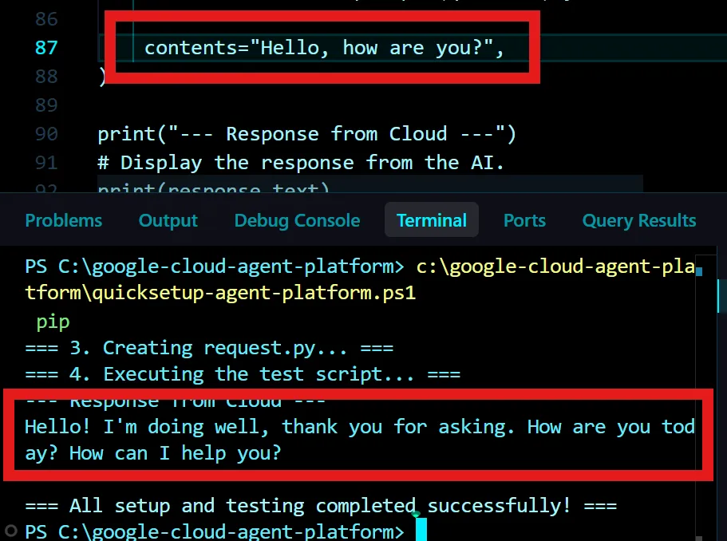
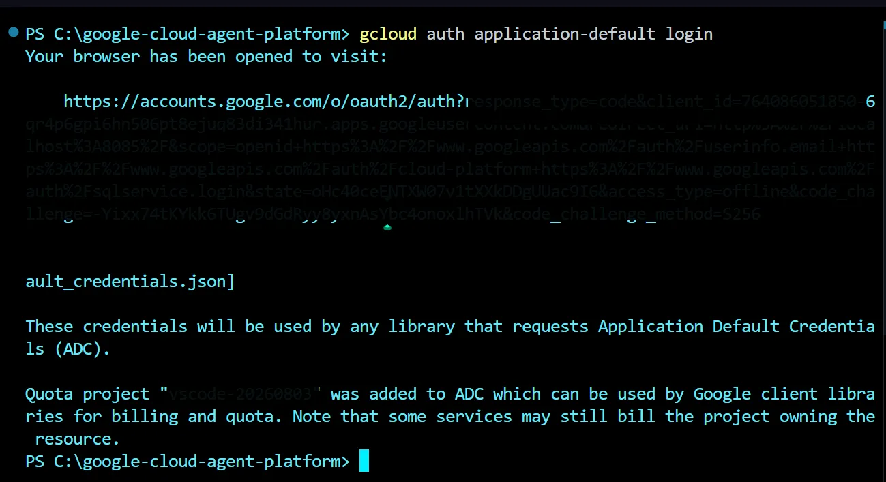
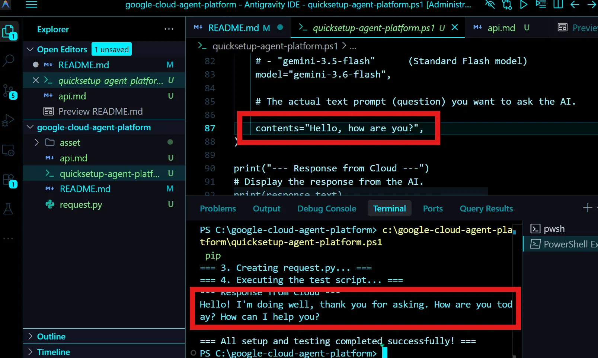
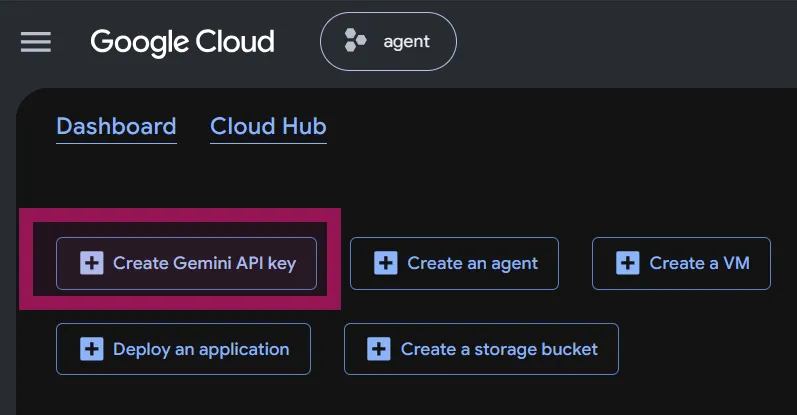
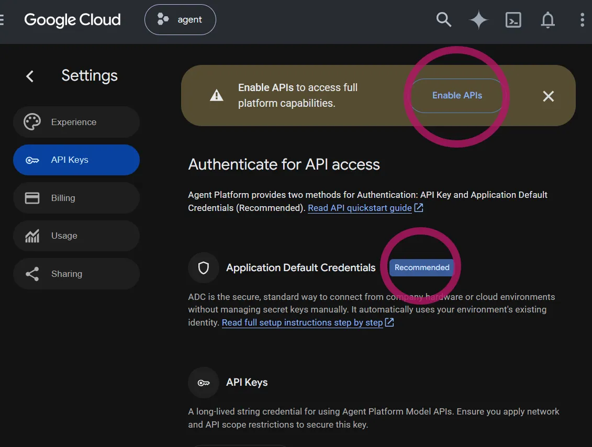
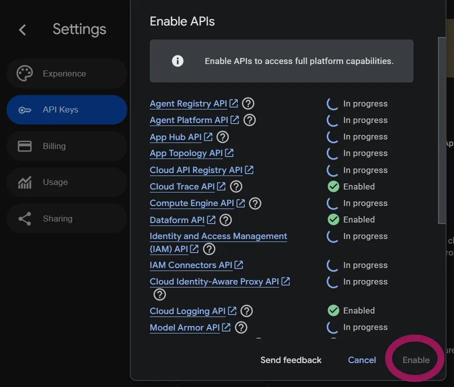

# Quick Setup: Google Cloud Agent Platform

If the Antigravity Quota is exhausted and unavailable, we will switch to the Google Cloud Agent. We will begin by establishing the connection.

A batch file that runs a Python script containing a simple message and displays the output in the terminal.



Prerequisite: A project has already been created in GCP. Project ID.
I will discuss the initial setup for Google Cloud next.

## Batch file

### how to run
Please run this file in the terminal. Update only the PROJECTID and run.

file: [quicksetup-agent-platform.ps1](quicksetup-agent-platform.ps1)


```powershell
//command
./quicksetup-agent-platform.ps1

```


## Process

### Set project ID

```ps1
$env:GOOGLE_CLOUD_PROJECT = "PROJECT ID"
```
projectID
ID change, [quicksetup-agent-platform.ps1#L50](quicksetup-agent-platform.ps1#L50) 


Set the location to "global":
```powershell
$env:GOOGLE_CLOUD_LOCATION = "global"
$env:GOOGLE_GENAI_USE_ENTERPRISE = "True"
```
Install the package:
```powershell
pip install --upgrade google-genai
```
Generate the following code to execute the above:
Automatically create a test script (request.py)

### Model Select
Select the agent to use on Google Cloud:

Model is set to model="gemini-3.6-flash".
To change the model, please edit [quicksetup-agent-platform.ps1#L83](quicksetup-agent-platform.ps1#L83).


```powershell
Set `model="gemini-3.6-flash"`.
```


### Prompt message

The query is as follows (modify it if necessary):

```powershell

contents="Hello, how are you?",

```

The prompt to ask the AI a question is [quicksetup-agent-platform.ps1#L87](quicksetup-agent-platform.ps1#L87).
 please edit.
I think you probably only need to set the projectID.


 
### Terminal login

Before running the file, you need to log in to Google Cloud from the Terminal.

```PowerShell
gcloud auth application-default login
```




### Execute file quicksetup-agent-platform.ps1  PowerShell


Now, execute it:
 
Python quicksetup-agent-platform.ps1

Or,
Drag and drop the file
Press Enter.

The reply to the message written in the Python file will be replied on the terminal.



That's all. Now you can see that you can connect to Google Cloud and chat.
After this, there will be general information such as settings for Google Cloud, etc.It also summarizes the meaning of Api.


## GCP Settings

https://console.cloud.google.com/welcome


### Api create

#### GoogleCloudtop


#### Click on "APIs & Services > enable aips 


#### api enble 



## API

# Api func detail list in Agentic Playground


### [Agent Registry API](https://docs.cloud.google.com/agent-registry/overview?hl=en_US)
This is an API for registering, managing, and sharing developed custom AI agents on the cloud. It will be used when operating complex autonomous AI in the future.


### [Agent Platform API](https://cloud.google.com/vertex-ai/?hl=en_US)
It is the heart of sending requests such as text generation to the Gemini model. **This is the only API required to run this code**.

### [App Hub API](https://cloud.google.com/app-hub/docs/?hl=en_US)
An API for logically grouping multiple resources that make up a large-scale application and making it easier to centrally manage them.

<details>
<summary>API func detail list more...</summary>

### [App Topology API](https://cloud.google.com/monitoring/docs/application-topology?hl=en_US)
This is an API for visualizing and analyzing how multiple systems and services are connected and communicating.

### [Cloud API Registry API](https://cloud.google.com/?hl=en_US)
This is an API that catalogs the various APIs developed and used within an organization, making it easier to search and manage them.

### [Cloud Trace API](https://cloud.google.com/trace/?hl=en_US)
This is an API that measures the time taken for program processing and identifies where delays occur in the system.

### [Compute Engine API](https://cloud.google.com/compute/?hl=en_US)
This is the most basic infrastructure construction API for creating and running your own virtual server (VM) on Google Cloud.

### [Dataform API](https://cloud.google.com/dataform/docs?hl=en_US)
This is an API for developing and operating data transformation pipelines using SQL in data warehouses such as BigQuery.

### [Identity and Access Management (IAM) API](https://cloud.google.com/iam/?hl=en_US)
This is an API that is the key to security for finely controlling access privileges such as "who can access what resources, and what operations they can perform."

### [IAM Connectors API](https://cloud.google.com/iam/docs/?hl=en_US)
This is an extended API for linking with external ID management systems (corporate account infrastructure, etc.) to achieve more flexible access control.

### [Cloud Identity-Aware Proxy API](https://cloud.google.com/iap?hl=en_US)
This is an API for "zero trust" that allows users to securely access internal systems and cloud applications based on their identity without using a VPN.

### [Cloud Logging API](https://cloud.google.com/logging/docs/?hl=en_US)
API for collecting, storing, and searching all system operation records and errors. It has been effective since the beginning and is essential for investigating the cause.

### [Model Armor API](https://cloud.google.com/security-command-center/docs/model-armor-overview?hl=en_US)
An API that monitors input and output to AI models and prevents malicious attacks such as sensitive data leakage and prompt injection.

### [Cloud Monitoring API](https://cloud.google.com/monitoring/api/?hl=en_US)
It is an API that monitors the health of the system (CPU usage rate, number of errors, etc.) and notifies alerts in the event of an abnormality, and has been effective from the beginning.

### [Network Security API](https://cloud.google.com/networking?hl=en_US)
This is an API that controls access to cloud networks and manages security rules to protect systems from cyber attacks.

### [Network Services API](https://cloud.google.com/networking?hl=en_US)
This is an API for building traffic load balancing (load balancer) and advanced routing functions between services.

### [Notebooks API](https://cloud.google.com/notebooks/docs/?hl=en_US)
This is an API for launching a Jupyter Notebook environment on the cloud and performing data analysis and machine learning development on a browser.

### [Observability API](https://cloud.google.com/stackdriver/docs/?hl=en_US)
This is an API that integrates data such as logs, monitoring, and traces to facilitate comprehensive "observability" of system health.

### [App Lifecycle Manager API](https://cloud.google.com/saas-runtime/docs?hl=en_US)
It is an API for managing the entire lifecycle of an application, from development to testing, publishing to the production environment, and operation.

### [Security Command Center API](https://cloud.google.com/security-command-center?hl=en_US)
This is an API that automatically scans the entire Google Cloud environment for security vulnerabilities and threats, centrally manages them, and issues warnings.

### [Cloud Storage](https://developers.google.com/storage/?hl=en_US)
A "warehouse" on the cloud that can store large amounts of all kinds of data such as images, videos, and text. It is also used as a storage place for AI learning data.

### [Telemetry API](https://cloud.google.com/stackdriver/docs/reference/telemetry/overview?hl=en_US)
This is an API that collects various remote information (telemetry data) generated from the system and efficiently sends it to the analysis platform.

### [Cloud Text-to-Speech API](https://cloud.google.com/text-to-speech/?hl=en_US)
This is an API that uses AI to convert text (characters) into natural human voice (audio) and read it out loud.

</details>

---


## ADC application default credentials


### linux mac terminal. run this command in your terminal.　bash

```bash

bash <(curl -sSL \
https://storage.googleapis.com/cloud-samples-data/adc/setup_adc.sh)


```

### windows PowerShell

```powershell

powershell -c "iex (irm https://storage.googleapis.com/cloud-samples-data/adc/setup_adc.ps1)"

```


