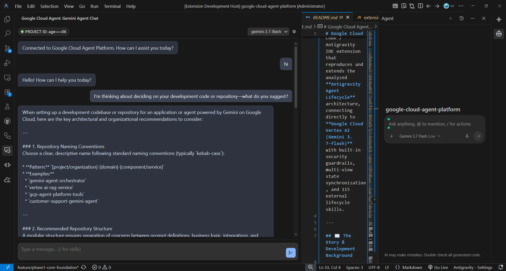

# GCP Agent Chat for Antigravity IDE & VS Code

> **Enterprise Google Cloud Vertex AI (Gemini 3.7-flash) Assistant for VS Code & Antigravity IDE**  
> *Seamless zero-CLI IDE Google login, autonomous multi-turn tool loops, pre-tool security firewalls, and instant fallback when default IDE quotas are exhausted.*

[](LICENSE)
[](package.json)
[](src/agent/hook_manager.js)
[](https://cloud.google.com/vertex-ai/docs/generative-ai/data-governance)
[](src/agent/hook_manager.js)
[](https://cloud.google.com/vertex-ai)
[](https://deepmind.google/technologies/gemini/)
[](package.json)
[](README.md)
[](README.md)
[](https://github.com/1abcdefggs/gcp-agent-chat/pulls)



---

## ⚡ Instant Quota Fallback & Direct Enterprise Connection

> **Never Stop Coding**: When your default Antigravity IDE / Gemini CLI daily quota is exhausted or unavailable, **GCP Agent Chat** seamlessly switches your development workflow to dedicated **Google Cloud Vertex AI** capacity using your own enterprise project quota.

* 🔑 **Zero-CLI IDE Login**: Sign in with your Antigravity IDE Google Account and start chatting instantly.
* ⚡ **Uninterrupted Capacity**: Direct connection to Vertex AI (`gemini-3.7-flash`, `gemini-2.5-pro`) with pay-as-you-go cloud quotas.
* 🛠️ **Autonomous Tool Loop**: Gemini autonomously inspects workspace files, runs diagnostics, and crafts complete solutions.
* 🛡️ **Zero-Token Local Security Guardrails**: PreToolUse security firewall intercepts token leaks and protects `.env` secrets.

---

## 📖 The Story & Development Background

### 1. The Origin: Direct Enterprise Cloud Connection
It started with a fundamental need: establishing an independent, enterprise-grade connection directly to Google Cloud Vertex AI (Gemini 3.7-flash) using Application Default Credentials (ADC) to ensure uninterrupted development even when default IDE quotas are exhausted. The initial prototype began as a simple PowerShell script (`quicksetup-gcp-agent-chat.ps1`) to verify API communication.

### 2. From Terminal to Custom Sidebar UI
Once cloud communication was proven, the next natural step was moving out of the terminal. We developed a custom VS Code extension (`src/extension.js`) embedding an interactive chat panel directly into the IDE's Primary and Secondary Sidebars. However, we quickly recognized that simple one-shot Q&A prompts were not enough — it lacked the true "autonomous, self-planning, and tool-using" capabilities of a native AI agent.

### 3. Uncovering the Core: VS Code OSS 1.107.0 & Antigravity Architecture
To understand how Antigravity natively executes autonomous agent loops, we investigated the underlying IDE version: **Antigravity IDE 2.5.5 (VSCode OSS 1.107.0 / Commit `ecfbad74d93962fc8ca485d93ab9b4f3d4cb6cf8`)**.
Release 1.107 introduced a paradigm shift with **Agent Sessions, Multi-Agent Orchestration, Background Execution, and Tool Call Folding**.

### 4. Special Gratitude & Acknowledgement
We extend our deepest gratitude to the **`lumusitech/AI`** repository and its author, **Carlos Luciano Figueroa**. Thanks to their deep reverse-engineering of Antigravity and VS Code agent mechanics, we were able to clearly identify the indispensable building blocks required for native agent chat and autonomous tool execution. This profound architectural insight was pivotal in empowering us to reconstruct, adapt, and build our own native GCP Agent Chat Platform.

### 5. The Synthesis: Native IDE Platform meets Google Cloud Power
While the upstream research packaged these concepts as Linux-centric OS-level dotfiles (`~/.agent`), we synthesized these proven lifecycle theories directly into a **cross-platform (Windows/macOS/Linux), IDE-native architecture**:
- Replacing bash scripts with cross-platform Node.js & Python modules.
- Introducing `ChatStateManager` for real-time dual-sidebar synchronization.
- Upgrading one-shot execution to a persistent stdio JSON-RPC 2.0 background daemon.
- Injecting the 115 external skills on demand via `/` slash commands, protected by local zero-token security guardrails.

### 6. Two-Repository Modular Architecture (Engine vs. Skills)
To maintain high modularity and clean separation of concerns, the system operates across two dedicated repositories under our management:
* **Execution Platform (This Repo: `gcp-agent-chat`)**: The IDE extension engine, state manager, Python JSON-RPC daemon, security guardrails, and UI panels.
* **Specialized Skills Library (`antigravity-agent-lifecycle`)**: Our forked repository containing the 115 curated agent workflow skills and analytical lifecycle knowledge.

`SkillManager` dynamically references and loads the skills repository on the fly without duplicating code, allowing both the engine and skillsets to evolve independently.

---

## 🏛️ Architecture Overview

This platform implements the reverse-engineered internal lifecycle specifications of Antigravity IDE:

```text
┌─────────────────────────────────────────────────────────────────────────────┐
│ [Primary / Secondary Sidebar Webviews] (Dual-Sidebar Synchronized UI)       │
└──────────────────────────────────────┬──────────────────────────────────────┘
                                       │ postMessage (State Sync)
                                       ▼
┌─────────────────────────────────────────────────────────────────────────────┐
│ [ChatStateManager] (Single Source of Truth across Sidebars)                 │
└──────────────────┬───────────────────────────────────────┬──────────────────┘
                   │                                       │
                   ▼                                       ▼
┌──────────────────────────────────────┐ ┌────────────────────────────────────┐
│ [HookManager] (PreToolUse Firewall)  │ │ [SkillManager] (115 Antigravity    │
│  - Blocks .env leaks                 │ │  Skills scanned from repo & loaded │
│  - Blocks destructive commands       │ │  via slash commands: /plan, /audit)│
└──────────────────┬───────────────────┘ └────────────────────────────────────┘
                   │
                   ▼
┌─────────────────────────────────────────────────────────────────────────────┐
│ [RpcClient] (Persistent Stdio JSON-RPC 2.0 Daemon)                          │
└──────────────────────────────────────┬──────────────────────────────────────┘
                                       │ JSON-RPC 2.0 (UTF-8)
                                       ▼
┌─────────────────────────────────────────────────────────────────────────────┐
│ [chat_bridge.py] (Python Daemon with Google GenAI SDK & ADC)                │
└──────────────────────────────────────┬──────────────────────────────────────┘
                                       │ Vertex AI API
                                       ▼
                        [Google Cloud: Gemini 3.7-flash]
```

### Key Capabilities & Features

1. **Native Antigravity IDE Authentication (Zero-CLI)**:
   - Authenticate seamlessly using your Antigravity IDE Google Account (`vscode.authentication`). Simply log into the IDE, set your Project ID, and start chatting without running terminal commands.
2. **Multi-Account Coexistence (`gcpAgentChat.authMode`)**:
   - Supports `auto`, `ide`, `gcloud` ADC, and `serviceAccount`. Seamlessly switch between your IDE account and client/external GCP projects.
3. **Interactive Authentication Manager**:
   - Click the `● GCP : Connected` / `● GCP : Disconnected` badge to access the interactive QuickPick menu for one-click login, account switching, status refresh, and token revocation.
4. **Session History & Instant Switcher**:
   - Start a fresh session with `+` (New Chat) or switch and resume past conversations with `🕘` (Session History QuickPick). Export sessions to Markdown with `⬇`.
5. **Autonomous Multi-Turn Tool Execution**:
   - Gemini autonomously calls workspace inspection tools (`read_file`, `list_files`, `run_command`) to investigate actual files and run non-destructive commands before answering.
6. **Multi-Modal Visual Analysis**:
   - Attach or paste screenshots directly into prompts for visual code reviews, UI layout debugging, and multimodal reasoning.
7. **Dual-Sidebar Realtime Synchronization**:
   - Supports both Primary (left) and Secondary (right) sidebars simultaneously via `ChatStateManager`.
8. **PreToolUse Security Guardrails**:
   - Local firewall intercepts and blocks attempts to access `.env` files, dump sensitive environment variables, or execute destructive commands.
9. **Dynamic 115 Skills Ingestion**:
   - Scans external skills from `antigravity-agent-lifecycle` (`skills/`) and injects them on demand via slash commands (e.g. `/plan-phases-create`, `/solid-audit`).

---

## 🚀 Getting Started & User Guide

### 1. Installation

Install the `.vsix` extension package via VS Code / Antigravity IDE:

```powershell
code --install-extension gcp-agent-chat-0.5.0.vsix
```

### 2. Connecting to Google Cloud

You can connect using any of the following methods:

* **Method A: Zero-CLI Antigravity IDE Login (Fastest)**
  1. Sign in to your Google Account at the top right of Antigravity IDE.
  2. Open Settings (`Ctrl+,`) and set `gcpAgentChat.projectId` to your Google Cloud Project ID.
  3. The status badge will turn to `● GCP : Connected`.
* **Method B: Status Badge QuickPick Menu**
  1. Click the `● GCP : Disconnected` badge in the chat header.
  2. Select **"Sign in with Antigravity IDE"** or **"Sign in with gcloud CLI"**.
* **Method C: Terminal gcloud ADC**
  ```powershell
  gcloud auth application-default login
  ```
  > **Note**: Upon completing the browser authorization, Google will send an official security email stating *"Google Auth Library was granted access to your Google Account"*. This is the standard, expected confirmation from Google.

### 3. Basic Operations & Shortcuts

| Action | UI Element / Command | Description |
|---|---|---|
| **New Chat Session** | `+` (Header Button) | Clears current context and starts a fresh conversation |
| **Session History** | `🕘` (Header Button) | Opens QuickPick menu to search and restore past chat logs |
| **Export Markdown** | `⬇` (Header Button) | Exports current conversation to `.agents/artifacts/chat_*.md` |
| **Auth & Account Manager** | `● GCP : Connected` (Badge) | View active account, switch auth modes, or logout |
| **Open Settings** | `⚙` (Header Button) | Opens `gcpAgentChat` configuration settings |
| **Attach Screenshots** | `📎` (Toolbar / Paste) | Upload or paste images (PNG, JPEG, WEBP) into the prompt |
| **Slash Commands** | Type `/` in input | Triggers autocomplete for 115 Antigravity workflow skills |

### 4. Standalone Connection Test (Terminal Verification)

If you wish to verify your Google Cloud Vertex AI connectivity and ADC quota directly in your terminal before launching the IDE chat, run the included verification script:

```powershell
./scripts/quicksetup-gcp-agent-chat.ps1
```
This script executes a lightweight Python verification probe to validate API quotas, Project ID resolution, and Gemini 3.7-flash connectivity.

---

## ⚙️ Configuration Settings

Configure the extension in VS Code / Antigravity IDE Settings (`gcpAgentChat.*`):

| Setting | Default | Description |
|---|---|---|
| `gcpAgentChat.projectId` | `""` | Google Cloud Project ID (Optional; auto-detected if empty) |
| `gcpAgentChat.location` | `"global"` | Google Cloud Region / Location (e.g. `global`, `us-central1`) |
| `gcpAgentChat.authMode` | `"auto"` | Authentication mode (`auto`, `ide`, `gcloud`, `serviceAccount`) |
| `gcpAgentChat.model` | `"gemini-3.7-flash"` | Default Gemini Model (`gemini-3.7-flash`, `gemini-2.5-pro`, etc.) |
| `gcpAgentChat.language` | `"auto"` | Target response language (`auto`, `ja`, `en`, `fr`, `de`, `es`, etc.) |
| `gcpAgentChat.monthlyBudgetLimit` | `10` | Monthly budget limit ($) for Vertex AI token usage protection |
| `gcpAgentChat.sessionStorageLocation` | `"global"` | Chat log storage location (`global` AppData or `workspace` `.agents/sessions/`) |

---

## 📜 Acknowledgements & Attributions

This project references and incorporates architectural concepts, skills, and security hooks from the [antigravity-agent-lifecycle](https://github.com/1abcdefggs/antigravity-agent-lifecycle) (upstream: [lumusitech/AI](https://github.com/lumusitech/AI)) project by **Carlos Luciano Figueroa**, licensed under the MIT License.

---

## 📂 Project Structure

```text
c:\google-cloud-gcp-agent-chat\
├── src/
│   ├── extension.js               # Extension entrypoint & Webview provider
│   ├── chat_bridge.py             # Persistent stdio JSON-RPC 2.0 daemon with Tool Loop
│   ├── mcp_server.py              # Model Context Protocol (MCP) server
│   │
│   ├── auth/
│   │   └── auth_manager.js        # IDE Google Auth & gcloud ADC Hybrid Manager
│   │
│   ├── state/
│   │   └── chat_state_manager.js  # Cross-sidebar conversation & status sync
│   │
│   ├── storage/
│   │   └── session_storage.js     # JSONL session persistence & history loader
│   │
│   ├── bridge/
│   │   └── rpc_client.js          # Node.js JSON-RPC supervisor for Python daemon
│   │
│   ├── agent/
│   │   ├── hook_manager.js        # PreToolUse security firewall
│   │   └── skill_manager.js       # External skills scanner & slash commands
│   │
│   └── media/
│       ├── chat.html              # Modern Webview UI layout & header actions
│       ├── chat.css               # Premium deep dark OLED color theme
│       ├── chat.js                # Webview event controller & message bridge
│       ├── markdown_renderer.js   # Modular markdown parser & code block actions
│       └── image_handler.js       # Multi-modal image attachment processing
│
├── docs/
│   ├── antigravity_agent_architecture.md # Full architecture specification
│   ├── phase1_implementation_design.md   # Phase 1 technical design
│   ├── phase2_implementation_design.md   # Phase 2 technical design
│   └── phase3_implementation_design.md   # Phase 3 technical design
│
├── LICENSE                        # Open-source MIT license
└── package.json                   # Extension manifest & views configuration
```

---

## 📋 Version History & Release Notes

For detailed release notes and historical changes of each version, see **[CHANGELOG.md](CHANGELOG.md)**.

* **[v0.7.1] (Latest)**: Interactive welcome screen with live GCP connection states & one-click sign-in button, enhanced Google Auth Library security guidance, and configuration normalization.
* **[v0.7.0]**: Official character logo (`asset/gcpagent-logo.jpg`), Editor direct integration, Real-time cost tracker, Multi-modal image vision, and JSONL session logging.
* **[v0.5.0]**: Antigravity IDE zero-CLI authentication (`vscode.authentication`) and multi-account hybrid manager (`gcpAgentChat.authMode`).
* **[v0.4.9]**: Autonomous function calling multi-turn tool loop in `chat_bridge.py`.
* **[v0.2.0]**: Dual-sidebar real-time synchronization, persistent JSON-RPC 2.0 daemon, and 115 skills ingestion.
* **[v0.1.0]**: Initial prototype connecting Antigravity IDE directly to Vertex AI.
